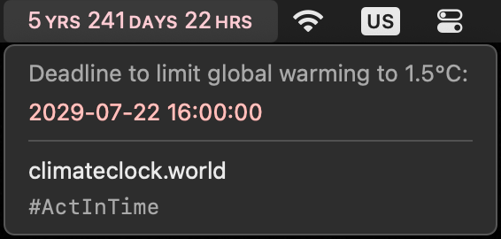

# climate-clock-menu-bar

SwiftBar plugin to see the climate clock deadline from [climateclock.world](https://climateclock.world/) in the menu bar


## Purpose

This script provides a countdown clock to the deadline set by [climateclock.world](https://climateclock.world/) (until which we need to limit global warming to 1.5°C) to the macOS menu bar using [SwiftBar](https://github.com/swiftbar/SwiftBar).

To minimize API calls and provide better performance, it keeps the current deadline in a cache file (see instructions below) and only queries the API once every 24h, as the value gets adjusted rarely.


## Screenshot




## Setup

### 1. Install the latest SwiftBar release

Follow the instructions on the [SwiftBar](https://github.com/swiftbar/SwiftBar) page.


### 2. Ensure you have Python3 and the required packages installed

Install python3 e.g. with the [homebrew package manager](https://brew.sh):
```shell
brew install python3
```

Furthermore, the following two packages are needed from PyPi:
- pendulum
- requests

Install them in a virtual environment (recommended), e.g. via `uv`:
```shell
uv init && uv add pendulum requests
```


### 3. Download the "climate_clock.15m.py" script

1. [Download](https://github.com/niklasbogensperger/climate-clock-menu-bar/blob/main/climate_clock.15m.py) the file
2. Open the file in a plain text editor or IDE of your choice
   - Change the first line of the script to point to the python3 executable located within the virtual environment created above
   - Should you want to modify the default configuration, set the configuration variables according to your liking (see next section)
3. Copy/Move it to the SwiftBar script folder that you or the app chose
4. Make sure the file is executable: `chmod +x climate_clock.15m.py`


### 4. Configuration options

You can easily tweak how the clock gets displayed in the menu bar:<br />
`LABELS_LONG` controls whether to use long or short labels, and `MINUTES_SECONDS` controls whether to show a full clock with minutes and seconds or just the hours with a label.<br />
**Note**: When using the `MINUTES_SECONDS` option, you should set the refresh rate of the script accordingly (in the filename itself, see [here](https://github.com/swiftbar/SwiftBar#plugin-naming)). 

Refer to the table below to see which format you prefer.

| `LABELS_LONG` | `MINUTES_SECONDS` | Output                  | Notes                                |
| ------------- | ----------------- | ----------------------- | ------------------------------------ |
| False         | False             | 0 ʏ 000 ᴅ 00 ʜ          | default                              |
| False         | True              | 0 ʏ 000 ᴅ 00:00:00      | adjust refresh rate (see note above) |
| True          | False             | 0 ʏʀꜱ 000 ᴅᴀʏꜱ 00 ʜʀꜱ   |                                      |
| True          | True              | 0 ʏʀꜱ 000 ᴅᴀʏꜱ 00:00:00 | adjust refresh rate (see note above) |

In addition, you can change where the cache file is saved by changing the (absolute) path in the `CACHE_FILE` variable. The sensible default is the cache directory for this plugin, which is automatically created by SwiftBar.

Lastly, should the API move to a different URL at some point in the future, this can be incorporated by changing the URL in the `API_URL` variable. Note, however, that such a change will probably necessitate tweaks in the rest of the code as well.


## Miscellaneous tips/tricks and notes

> [!TIP]
> Hold the <kbd>⌥ Option</kbd> key while clicking on the menu bar entry to bring up SwiftBar options that are hidden by default.

> [!TIP]
> Hold the <kbd>⌘ Command</kbd> key to drag the menu bar entry to the desired spot.
